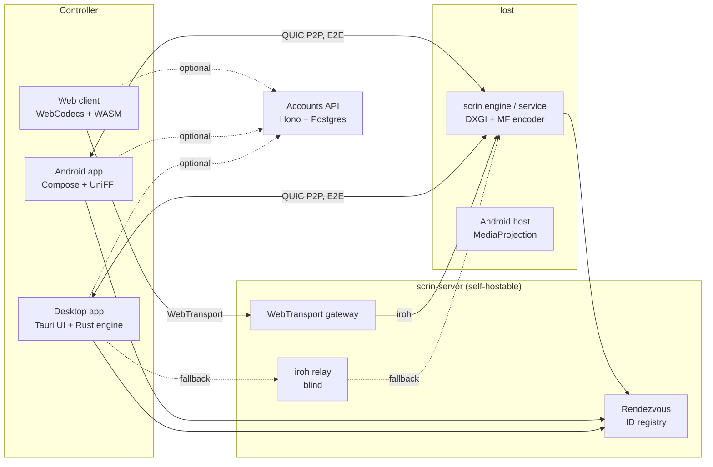

# scrin

**Open-source remote desktop.** Connect to any machine in seconds with an ID and a one-time
code, leave trusted devices reachable unattended, stream at gaming-grade latency, and manage
fleets for your team or your customers — on infrastructure you can run yourself.

scrin is licensed under **AGPL-3.0-only**. Status: **pre-alpha** — the foundation and the
cryptographic core are being built; nothing is released yet. Progress lives in
[`docs/TRACKER.md`](docs/TRACKER.md).

## Features (v1 scope)

- **Quick connect** — 9-digit ID + 8-character one-time code (10 min, single use). The code
  never leaves the device: both sides run SPAKE2 over it and compare 5 emoji (SAS).
- **End-to-end encrypted** — Ed25519 device keys, QUIC (iroh) peer-to-peer with hole punching;
  relays and the browser gateway only ever see ciphertext.
- **Unattended access** — per-host trust list of controller keys, optional permanent password
  (Argon2id verifier, checked through a PAKE), SYSTEM service for UAC and the login screen.
- **Low latency** — DXGI Desktop Duplication, hardware Media Foundation encoders (openh264
  fallback), video over QUIC datagrams with adaptive Reed-Solomon FEC and delay-based bandwidth
  estimation.
- **Everything a support session needs** — audio, clipboard, file transfer, chat, whiteboard,
  multi-monitor, recording with a signed audit chain, virtual display + privacy mode, gamepads.
- **Anti-scam by design** — pre-accept interstitial, verified badges, caps on anonymous sessions,
  sensitive-app blur, one-click Stop & report.
- **Teams / MSP** — optional accounts with address book, device groups, orgs, roles, policies,
  JIT access and branding.
- **Modern UI** — light/dark/system themes, OKLCH accent, glass/solid/AMOLED surfaces, reduced
  motion, WCAG 2.2 AA, English and Romanian.

## Platforms

| Platform | Client (controls) | Host (is controlled) |
|---|---|---|
| Windows 10/11 | ✅ v1 | ✅ v1 (incl. UAC + login screen) |
| Android 10+ | ✅ v1 | ✅ v1, attended (consent per session) |
| Browser (Chrome, Edge, Firefox, Safari 26) | ✅ v1 via WebTransport gateway | — |
| Android TV | planned | — |
| macOS, Linux, iOS | later | later |

## Architecture



Details: [`docs/ARCHITECTURE.md`](docs/ARCHITECTURE.md) · decisions: [`docs/adr/`](docs/adr/).

| Path | What |
|---|---|
| `crates/` | Rust core: proto, crypto, net, media, session, Windows platform, FFI, WASM, server |
| `apps/` | `desktop` (Tauri), `web` (client + console), `api` (accounts), `site` (docs) |
| `packages/` | shared UI, i18n, config, protocol, SDK, CLI, MCP |
| `android/` | Kotlin/Compose app, TV app, `core-ffi` |
| `proto/` | wire contract (`buf lint` + `buf breaking`) |

## Development quick start

Requirements: Windows 11 or Linux, Rust (pinned by `rust-toolchain.toml`), Node 24, pnpm 12,
PowerShell 7. Android work additionally needs JDK 21 and NDK 28.

```powershell
git clone https://github.com/scrin-app/scrin; cd scrin
pnpm install                 # JS workspace (also installs the git hooks)
cargo test --workspace       # Rust core
pwsh -NoProfile -File scripts/gates.ps1           # every quality gate, in parallel lanes
pwsh -NoProfile -File scripts/gates.ps1 -Only rust,invariants
```

See [`CONTRIBUTING.md`](CONTRIBUTING.md) before opening a pull request.

## Self-hosting

The whole server side — rendezvous, relay and browser gateway — ships as one Rust binary and a
`docker compose` bundle (planned for slice S3). Accounts are optional; quick connect works
against a bare server with no database. Point clients at your server in Settings → Network.

## Security

Report vulnerabilities privately — see [`SECURITY.md`](SECURITY.md). The security model is
described in [ADR-0004](docs/adr/0004-security-model.md).

## Licence

Copyright © scrin contributors. Licensed under the
[GNU Affero General Public License v3.0 only](LICENSE). If you run a modified scrin server or
client as a network service, you must offer its source to its users. Contributions are accepted
under the [Developer Certificate of Origin](https://developercertificate.org/)
([ADR-0001](docs/adr/0001-licence-agpl-dco.md)).
